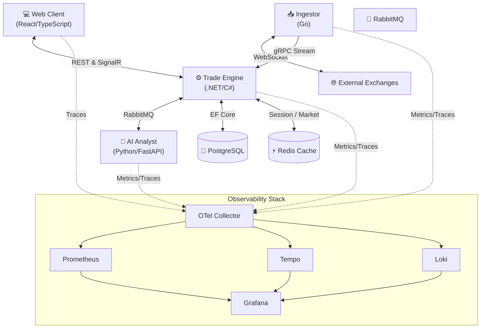

<div align="center">
  <h1>🚀 Crypto Investor Thesis</h1>
  <p><strong>Full-Stack Microservices Cryptocurrency Trading Platform</strong></p>

  [](LICENSE)
  [](https://react.dev)
  [](https://dotnet.microsoft.com/)
  [](https://go.dev/)
  [](https://www.python.org/)
</div>

---

## 📖 Overview

This repository houses the complete source code for a comprehensive cryptocurrency trading platform, developed as a bachelor's thesis in Computer Science. It leverages a modern microservices architecture to provide real-time market data ingestion, AI-driven sentiment analysis, a high-performance order matching engine, and a responsive web client.

## 🏗️ Architecture

The system is composed of five primary services communicating via a mix of synchronous and asynchronous protocols (REST, gRPC, RabbitMQ, SignalR).

### System Diagram



### Microservices Breakdown

| Service | Technology | Port | Primary Responsibility |
|---------|------------|------|------------------------|
| **`web-client`** | TypeScript, React 19, Vite | 3000 | Trading UI, Zustand state management, real-time updates via SignalR. |
| **`trade-engine`** | C#, .NET 10 | 5000 / 8080 | Core API, order matching engine (Channels), settlement, Clean Architecture. |
| **`ingestor`** | Go 1.25 | 50051 | High-throughput, real-time market data ingestion via gRPC. |
| **`ai-analyst`** | Python 3, FastAPI | 8000 | FinBERT-based market sentiment analysis. |
| **`infra`** | Docker Compose | Various | PostgreSQL 17, Redis, RabbitMQ, and the full Grafana observability suite. |

---

## ⚡ Quick Start

### Prerequisites
- [Docker & Docker Compose](https://www.docker.com/)
- [Node.js 22+](https://nodejs.org/) (for local web-client dev)
- [.NET 10 SDK](https://dotnet.microsoft.com/) (for local trade-engine dev)
- [Go 1.25+](https://go.dev/) (for local ingestor dev)

### Bootstrapping the Environment

The easiest way to get the entire platform running locally is via the root `Makefile`:

```bash
# Clone the repository
git clone https://github.com/your-username/crypto-investor-thesis.git
cd crypto-investor-thesis

# Start all services (detached mode)
make up

# Tail logs for all services
make logs
```

### Local Development

If you prefer to run individual services outside of Docker for development:

**Web Client:**
```bash
cd web-client
make install
make dev
```

**Trade Engine:**
```bash
cd trade-engine
make db-update # Run EF Core migrations
make run
```

**Ingestor:**
```bash
cd ingestor
make run
```

---

## 🧼 Clean Code Standards

To maintain a high-quality, top-tier open-source standard, this project strictly adheres to the following principles:

### Core Principles
- **SOLID Design:** Strict adherence to Single Responsibility, Open/Closed, Liskov Substitution, Interface Segregation, and Dependency Inversion.
- **DRY (Don't Repeat Yourself):** Logic is centralized in shared utilities, base classes, or hooks to avoid duplication.
- **Meaningful Naming:** Code is self-documenting. Variables, classes, and methods use clear, intent-revealing names without obscure abbreviations.
- **KISS & YAGNI:** Solutions are kept simple; we do not over-engineer or add speculative features.

### Domain-Specific Standards
- **Frontend (`web-client`):** Leverages **ES2026** features and modern **TypeScript**. React components are functional and pure. `Zustand` manages global state, while `React Query` handles server caching. Avoids `any` strictly.
- **Backend (`trade-engine`):** Built on **Clean Architecture**. The Domain layer is completely isolated from external frameworks. Uses `.NET Channels` for safe, lock-free concurrency in the order matching pipeline.
- **Observability:** OpenTelemetry is instrumented across all services. We enforce structured logging (with contextual properties) rather than plain text, ensuring all issues are traceable via Grafana.

---

## 🤝 Contributing

Contributions are welcome! Please ensure that any pull requests align with the [Clean Code Standards](#-clean-code-standards) outlined above and have accompanying unit or integration tests.

1. Fork the Project
2. Create your Feature Branch (`git checkout -b feature/AmazingFeature`)
3. Commit your Changes (`git commit -m 'Add some AmazingFeature'`)
4. Push to the Branch (`git push origin feature/AmazingFeature`)
5. Open a Pull Request

---

## 📄 License

This project is licensed under the MIT License - see the [LICENSE](LICENSE) file for details.
