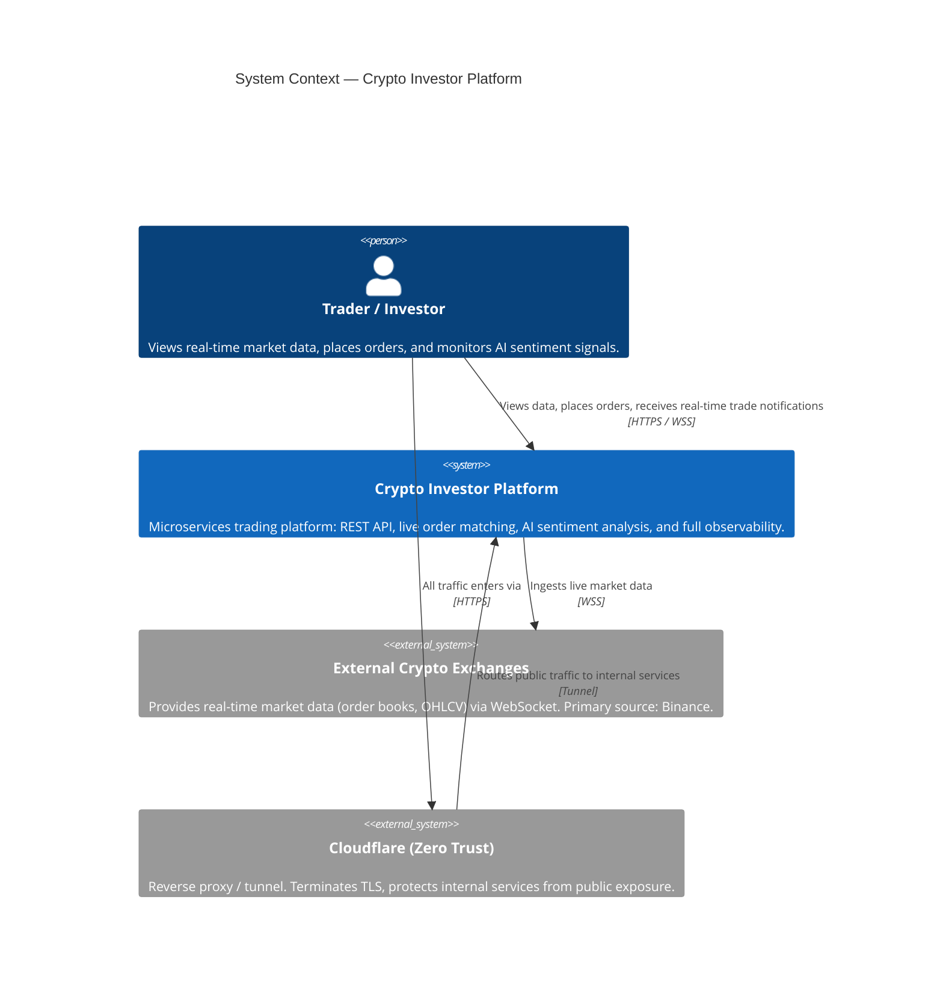
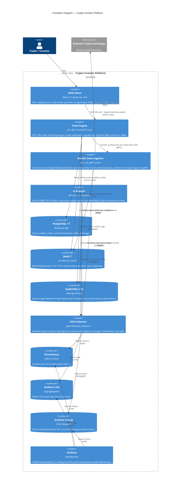
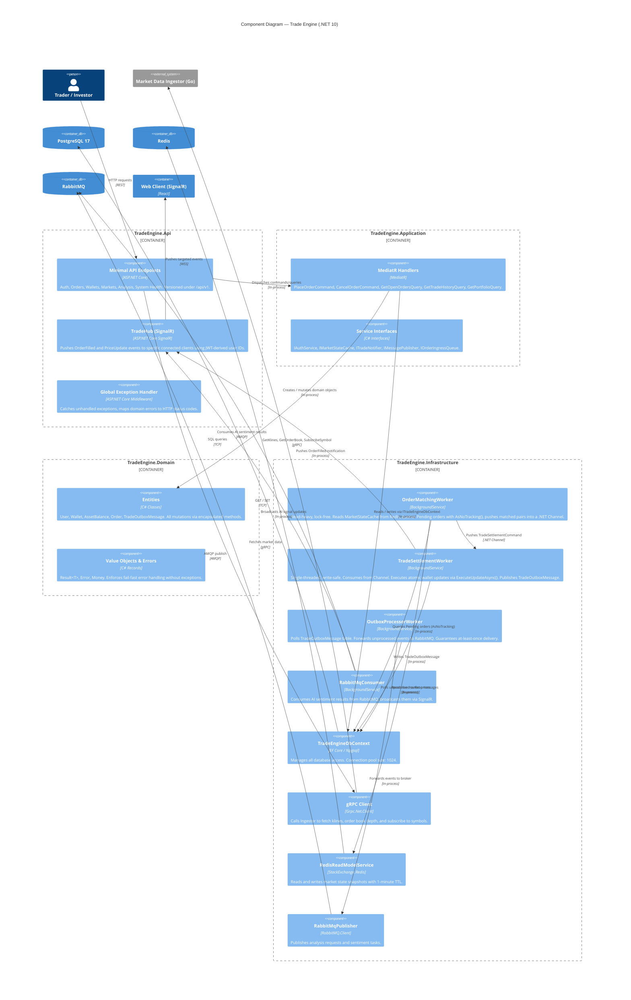
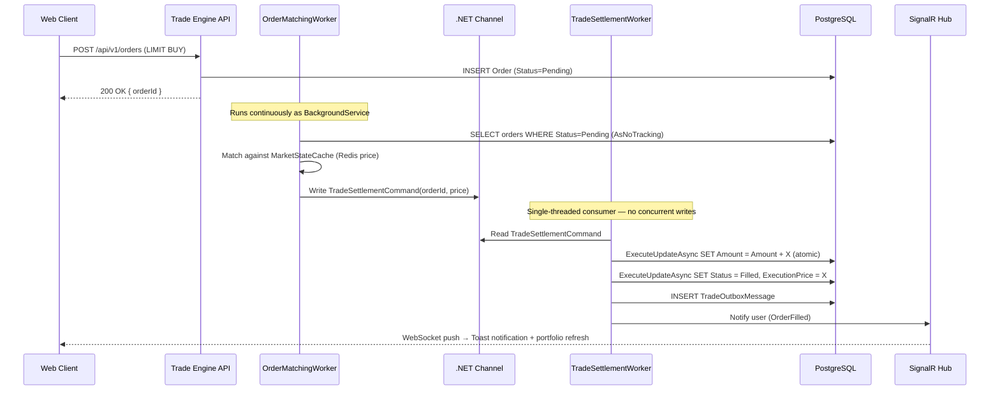

# C4 Architecture Model

This document provides a visual representation of the Crypto Investor platform using the C4 model and Mermaid.js, covering all four levels: Context, Container, Component, and key Code-level patterns.

---

## 1. System Context Diagram

High-level overview of actors and external systems.

---

## 2. Container Diagram

Zooms into the platform to show each runnable unit and data store.

---

## 3. Component Diagram — Trade Engine

Zooms into the Trade Engine to show its Clean Architecture layers and the Channel-based matching pipeline.

---

## 4. Key Architectural Pattern — Channel-Based Settlement Pipeline

The matching engine uses .NET Channels to achieve lock-free throughput. This is the core design decision that eliminates database deadlocks under high concurrency.

