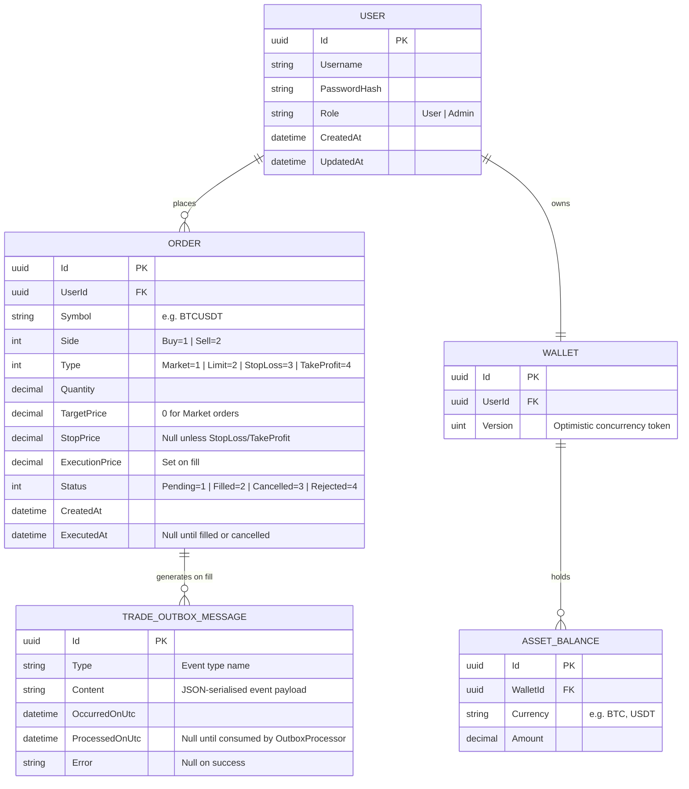

# Database Entity-Relationship Diagram (ERD)

This document illustrates the PostgreSQL database schema for the Crypto Investor platform, derived directly from the Entity Framework Core domain model.

## Core Schema

The database enforces ACID compliance for all wallet mutations via EF Core's `ExecuteUpdateAsync()` pattern, which pushes atomic `SET Amount = Amount + X` operations directly to the PostgreSQL engine, bypassing the ORM change tracker entirely.

## Design Decisions

### 1. Wallet Aggregate Pattern
A single `Wallet` per user acts as an aggregate root. It holds many `AssetBalance` child records — one per currency (BTC, USDT, ETH, etc.). Balances are mutated with atomic SQL (`ExecuteUpdateAsync`) to prevent double-spending without the overhead of pessimistic locking.

The `Version` (uint, maps to PostgreSQL `xmin`) provides optimistic concurrency. If two workers attempt to write the same wallet simultaneously, the second write fails fast — no deadlock required.

### 2. Order Lifecycle (no separate Trade table)
There is no dedicated TRADE table. A settled trade is represented by an `Order` record reaching `Status = Filled` with `ExecutionPrice` set. The `TradeSettlementWorker` performs the fill atomically:
1. Updates `Order.Status → Filled` and sets `ExecutionPrice`
2. Calls `Wallet.Deposit` / `Wallet.Withdraw` via `ExecuteUpdateAsync`
3. Publishes a `TradeOutboxMessage` for downstream fanout (SignalR, AI pipeline)

### 3. Transactional Outbox Pattern
`TradeOutboxMessage` stores domain events durably in the same PostgreSQL transaction as the trade settlement. A background `OutboxProcessor` service polls for unprocessed messages and forwards them to RabbitMQ. This guarantees **at-least-once delivery** without distributed transactions: if the broker is down, messages stay in the table until it recovers.

### 4. Symbol Encoding
Orders reference the trading pair as a single `Symbol` string (`"BTCUSDT"`) rather than separate `BaseAsset`/`QuoteAsset` columns. This matches the Binance WebSocket feed format that the Ingestor ingests, eliminating any translation layer.
